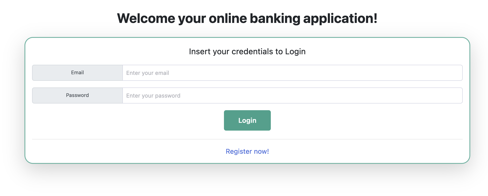

# Online Banking application

[![license: MIT][license-img]][license-link]

## About

Online Banking application is the final project of **"TIW-Informatic Technologies for the Web"**, course of **"Computer Science & Engineering"** held at Politecnico di Milano (2021/2022).

**Professor** Piero Fraternali

**Tutor** Federico Milani

**Tutor** Nicolò Oreste Pinciroli

<!Final Score:-->

### The Team

* [Giovanni Manfredi](https://github.com/Silemo)
* [Sebastiano Meneghin](https://github.com/TheLastSoldier)

## Specifications

The objective of the project is the implementation of a **web application** simulating an online banking website in two distinct versions:
* *pureHTML* : a thin client application connected to a **JAVA** server that communicates with an **SQL** database. The combination of **HTML+Thymeleaf+CSS** is used for the web pages;
* *RIA* (Rich Internet Application) : a thick client application using **JavaScript(JS)** connected to a **JAVA** server that communicates with an **SQL** database. The web pages are managed client-side with a combination of **HTML+JavaScript(JS)+CSS**;

All the requirements are specified in the specs file you can find [here][specs-link].

## Documentation

A full and complete documentation of the application design and implementation can be found at these respective links 
for the [pureHTML version][pureHTML-pdf-link] and [RIA version][RIA-pdf-link]. 

## The application - pureHTML

Here few pictures can be found of the working application (*pureHTML version*) in the web browser

Login page:

  

Register page:

  

Home page:

  

AccountDetails page:

  

TransferConfirmed page:

  

TransferFailed page:

  

Error page:

  

## The application - RIA

Here few pictures can be found of the working application (*RIA version*) in the web browser

Login and Register page:

  

Single page application, home and accountDetails:

  

TransferConfirmed pop-up:

  

TransferFailed pop-up:

  

## Software used

**Eclipse** - main IDE

**mySQLWorkbench** - SQL Database

**Firefox** - main browser

### Collaborative tools

**GitKraken** - github

**OneDrive** - file sharing

**Notion** - organisation

**Microsoft Teams** - web calls

### Documentation

**Microsoft PowerPoint** - presentation

**Draw.io** - Entity Relationship Diagrams and Sequence diagrams

**ifmledit.org** - IFML diagrams

<!Links of the document-->
[license-img]: https://img.shields.io/badge/license-GPL--3.0-blue
[license-link]: https://github.com/Silemo/tiw-2022-manfredi-meneghin/blob/master/LICENSE
[specs-link]: https://github.com/Silemo/tiw-2022-manfredi-meneghin/tree/main/specs
[pureHTML-pdf-link]: https://github.com/Silemo/tiw-2022-manfredi-meneghin/blob/main/derivables/pureHTML/tiw-2022-manfredi-meneghin-gruppo37-es4-pureHTML.pdf
[RIA-pdf-link]: https://github.com/Silemo/tiw-2022-manfredi-meneghin/blob/main/derivables/RIA/tiw-2022-manfredi-meneghin-gruppo37-es4-RIA.pdf

